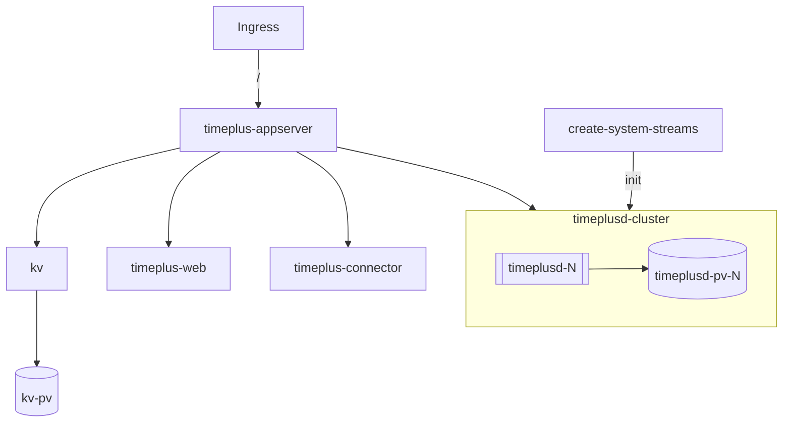
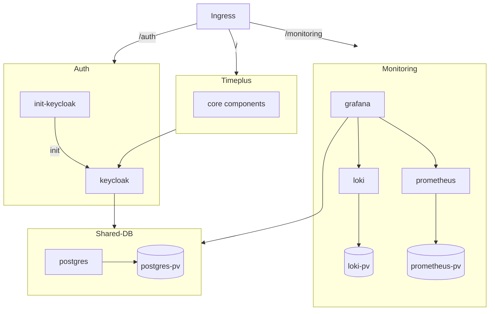

## Timeplus Installation Guide for Kubernetes

  

A Helm chart for deploying a Timeplus enterprise stack.

**Homepage:** <https://www.timeplus.com/>

## Prerequisites

- ingress-nginx-controller >= v4.6.0
- helm >= v3.12.3

## Requirements

Kubernetes: `>= 1.25.0-0`

## Install chart

1. Make sure you have all PVs ready
2. Update the `tag` of each images
3. Make sure those images are already in your local registry
4. Make sure you are using the right kubectl context
5. Run `helm upgrade --install -n timeplus -f values.yaml --create-namespace timeplus <chart>`
6. To uninstall, run `helm del timeplus -n timeplus`

## Values

<table>
	<thead>
		<th>Key</th>
		<th>Type</th>
		<th>Default</th>
		<th>Description</th>
	</thead>
	<tbody>
		<tr>
			<td>global.affinity</td>
			<td>object</td>
			<td><pre lang="json">
{}
</pre>
</td>
			<td></td>
		</tr>
		<tr>
			<td>global.imagePullPolicy</td>
			<td>string</td>
			<td><pre lang="json">
"IfNotPresent"
</pre>
</td>
			<td></td>
		</tr>
		<tr>
			<td>global.imageRegistry</td>
			<td>string</td>
			<td><pre lang="json">
""
</pre>
</td>
			<td>When modify this value, also remember to update `prometheus.server.image.repository`</td>
		</tr>
		<tr>
			<td>global.nodeSelector</td>
			<td>object</td>
			<td><pre lang="json">
{}
</pre>
</td>
			<td></td>
		</tr>
		<tr>
			<td>global.pvcDeleteOnStsDelete</td>
			<td>bool</td>
			<td><pre lang="json">
false
</pre>
</td>
			<td>These two options are only valid with k8s >= 1.27.0</td>
		</tr>
		<tr>
			<td>global.pvcDeleteOnStsScale</td>
			<td>bool</td>
			<td><pre lang="json">
false
</pre>
</td>
			<td></td>
		</tr>
		<tr>
			<td>global.tolerations</td>
			<td>list</td>
			<td><pre lang="json">
[]
</pre>
</td>
			<td></td>
		</tr>
		<tr>
			<td>ingress.domain</td>
			<td>string</td>
			<td><pre lang="json">
null
</pre>
</td>
			<td>If you want use an ip, pls remove it. it's will match all (equal *).</td>
		</tr>
		<tr>
			<td>ingress.enabled</td>
			<td>bool</td>
			<td><pre lang="json">
true
</pre>
</td>
			<td>You will need to manually create ingress if you don't want to enable it here.</td>
		</tr>
		<tr>
			<td>ingress.ingressClassName</td>
			<td>string</td>
			<td><pre lang="json">
"nginx"
</pre>
</td>
			<td>Only Nginx controller is tested. https://kubernetes.github.io/ingress-nginx/</td>
		</tr>
		<tr>
			<td>kv.affinity</td>
			<td>object</td>
			<td><pre lang="json">
{}
</pre>
</td>
			<td></td>
		</tr>
		<tr>
			<td>kv.enabled</td>
			<td>bool</td>
			<td><pre lang="json">
true
</pre>
</td>
			<td>KV service is required for Timeplus appserver</td>
		</tr>
		<tr>
			<td>kv.image</td>
			<td>string</td>
			<td><pre lang="json">
"timeplus/timeplusd"
</pre>
</td>
			<td></td>
		</tr>
		<tr>
			<td>kv.imagePullPolicy</td>
			<td>string</td>
			<td><pre lang="json">
"IfNotPresent"
</pre>
</td>
			<td></td>
		</tr>
		<tr>
			<td>kv.imageRegistry</td>
			<td>string</td>
			<td><pre lang="json">
""
</pre>
</td>
			<td></td>
		</tr>
		<tr>
			<td>kv.labels</td>
			<td>object</td>
			<td><pre lang="json">
{}
</pre>
</td>
			<td>Labels that apply to pod and sts</td>
		</tr>
		<tr>
			<td>kv.resources</td>
			<td>object</td>
			<td><pre lang="json">
{}
</pre>
</td>
			<td></td>
		</tr>
		<tr>
			<td>kv.storage</td>
			<td>object</td>
			<td><pre lang="json">
{
  "className": "local-storage",
  "selector": {
    "matchLabels": {
      "app": "kv"
    }
  },
  "size": "10Gi"
}
</pre>
</td>
			<td>PV-related settings.</td>
		</tr>
		<tr>
			<td>timeplus.port</td>
			<td>string</td>
			<td><pre lang="json">
"80"
</pre>
</td>
			<td>If you'd like to use a non 80 port and auth is enabled, you need to modify the baseUrl and port value in auth section as well. Make sure the port number below is quoted.</td>
		</tr>
		<tr>
			<td>timeplus.publicDomain</td>
			<td>string</td>
			<td><pre lang="json">
null
</pre>
</td>
			<td>Public domain or ip address of the cluster, e.g. `timeplus.local`. Do not include http schema or port number.</td>
		</tr>
		<tr>
			<td>timeplusAppserver.affinity</td>
			<td>object</td>
			<td><pre lang="json">
{}
</pre>
</td>
			<td></td>
		</tr>
		<tr>
			<td>timeplusAppserver.configs</td>
			<td>object</td>
			<td><pre lang="json">
{}
</pre>
</td>
			<td>e.g. `enable-authentication: true`</td>
		</tr>
		<tr>
			<td>timeplusAppserver.enabled</td>
			<td>bool</td>
			<td><pre lang="json">
true
</pre>
</td>
			<td>Timeplus web, Timeplus connector will not work properly if Timeplus appserver is not enabled.</td>
		</tr>
		<tr>
			<td>timeplusAppserver.image</td>
			<td>string</td>
			<td><pre lang="json">
"timeplus/timeplus-appserver"
</pre>
</td>
			<td></td>
		</tr>
		<tr>
			<td>timeplusAppserver.imagePullPolicy</td>
			<td>string</td>
			<td><pre lang="json">
"IfNotPresent"
</pre>
</td>
			<td></td>
		</tr>
		<tr>
			<td>timeplusAppserver.imageRegistry</td>
			<td>string</td>
			<td><pre lang="json">
""
</pre>
</td>
			<td></td>
		</tr>
		<tr>
			<td>timeplusAppserver.labels</td>
			<td>object</td>
			<td><pre lang="json">
{}
</pre>
</td>
			<td>Labels that apply to pod and deployment</td>
		</tr>
		<tr>
			<td>timeplusAppserver.replicas</td>
			<td>int</td>
			<td><pre lang="json">
1
</pre>
</td>
			<td>Current we don't support replicas > 1</td>
		</tr>
		<tr>
			<td>timeplusAppserver.resources</td>
			<td>object</td>
			<td><pre lang="json">
{}
</pre>
</td>
			<td></td>
		</tr>
		<tr>
			<td>timeplusConnector.affinity</td>
			<td>object</td>
			<td><pre lang="json">
{}
</pre>
</td>
			<td></td>
		</tr>
		<tr>
			<td>timeplusConnector.enabled</td>
			<td>bool</td>
			<td><pre lang="json">
true
</pre>
</td>
			<td></td>
		</tr>
		<tr>
			<td>timeplusConnector.image</td>
			<td>string</td>
			<td><pre lang="json">
"timeplus/timeplus-connector"
</pre>
</td>
			<td></td>
		</tr>
		<tr>
			<td>timeplusConnector.imagePullPolicy</td>
			<td>string</td>
			<td><pre lang="json">
"IfNotPresent"
</pre>
</td>
			<td></td>
		</tr>
		<tr>
			<td>timeplusConnector.imageRegistry</td>
			<td>string</td>
			<td><pre lang="json">
""
</pre>
</td>
			<td></td>
		</tr>
		<tr>
			<td>timeplusConnector.labels</td>
			<td>object</td>
			<td><pre lang="json">
{}
</pre>
</td>
			<td>Labels that apply to pod and deployment</td>
		</tr>
		<tr>
			<td>timeplusConnector.resources</td>
			<td>object</td>
			<td><pre lang="json">
{}
</pre>
</td>
			<td></td>
		</tr>
		<tr>
			<td>timeplusWeb.affinity</td>
			<td>object</td>
			<td><pre lang="json">
{}
</pre>
</td>
			<td></td>
		</tr>
		<tr>
			<td>timeplusWeb.enabled</td>
			<td>bool</td>
			<td><pre lang="json">
true
</pre>
</td>
			<td></td>
		</tr>
		<tr>
			<td>timeplusWeb.image</td>
			<td>string</td>
			<td><pre lang="json">
"timeplus/timeplus-web"
</pre>
</td>
			<td></td>
		</tr>
		<tr>
			<td>timeplusWeb.imagePullPolicy</td>
			<td>string</td>
			<td><pre lang="json">
"IfNotPresent"
</pre>
</td>
			<td></td>
		</tr>
		<tr>
			<td>timeplusWeb.imageRegistry</td>
			<td>string</td>
			<td><pre lang="json">
""
</pre>
</td>
			<td></td>
		</tr>
		<tr>
			<td>timeplusWeb.labels</td>
			<td>object</td>
			<td><pre lang="json">
{}
</pre>
</td>
			<td>Labels that apply to pod and deployment</td>
		</tr>
		<tr>
			<td>timeplusWeb.resources</td>
			<td>object</td>
			<td><pre lang="json">
{}
</pre>
</td>
			<td></td>
		</tr>
		<tr>
			<td>timeplusd.additionalUsers</td>
			<td>list</td>
			<td><pre lang="json">
[
  {
    "password": "changeme",
    "username": "timeplus_user"
  }
]
</pre>
</td>
			<td>The users that you can use to login Timeplus web. You will need to provision at least one user if you want to use Timeplus web and Timeplus appserver.</td>
		</tr>
		<tr>
			<td>timeplusd.affinity</td>
			<td>object</td>
			<td><pre lang="json">
{}
</pre>
</td>
			<td>Control both timeplusd and init job</td>
		</tr>
		<tr>
			<td>timeplusd.config</td>
			<td>object</td>
			<td><pre lang="json">
{}
</pre>
</td>
			<td></td>
		</tr>
		<tr>
			<td>timeplusd.defaultAdminPassword</td>
			<td>string</td>
			<td><pre lang="json">
"timeplusd@t+"
</pre>
</td>
			<td>The admin username is hardcoded to be `proton`. Timeplus appserver will use this username and password to connect to timeplusd to perform some administration operations such as user management. You are NOT able to use login Timeplus web. Please use the `additionalUsers` below.</td>
		</tr>
		<tr>
			<td>timeplusd.enabled</td>
			<td>bool</td>
			<td><pre lang="json">
true
</pre>
</td>
			<td></td>
		</tr>
		<tr>
			<td>timeplusd.image</td>
			<td>string</td>
			<td><pre lang="json">
"timeplus/timeplusd"
</pre>
</td>
			<td></td>
		</tr>
		<tr>
			<td>timeplusd.imagePullPolicy</td>
			<td>string</td>
			<td><pre lang="json">
"IfNotPresent"
</pre>
</td>
			<td></td>
		</tr>
		<tr>
			<td>timeplusd.imageRegistry</td>
			<td>string</td>
			<td><pre lang="json">
""
</pre>
</td>
			<td></td>
		</tr>
		<tr>
			<td>timeplusd.ingress.enabled</td>
			<td>bool</td>
			<td><pre lang="json">
false
</pre>
</td>
			<td>Enable ingress if you want to connect to timeplusd directly</td>
		</tr>
		<tr>
			<td>timeplusd.ingress.restPath</td>
			<td>string</td>
			<td><pre lang="json">
"/timeplusd"
</pre>
</td>
			<td>To send REST API call to timeplusd, the URL will be http(s)://<publicDomain>:<port><restPath> e.g.   - curl http://timeplus.local/timeplusd/info   - curl http://timeplus.local/timeplusd/v1/ddl/streams</td>
		</tr>
		<tr>
			<td>timeplusd.initJob.image</td>
			<td>string</td>
			<td><pre lang="json">
"timeplus/boson"
</pre>
</td>
			<td></td>
		</tr>
		<tr>
			<td>timeplusd.initJob.imagePullPolicy</td>
			<td>string</td>
			<td><pre lang="json">
"IfNotPresent"
</pre>
</td>
			<td></td>
		</tr>
		<tr>
			<td>timeplusd.initJob.imageRegistry</td>
			<td>string</td>
			<td><pre lang="json">
""
</pre>
</td>
			<td></td>
		</tr>
		<tr>
			<td>timeplusd.initJob.resources</td>
			<td>object</td>
			<td><pre lang="json">
{}
</pre>
</td>
			<td></td>
		</tr>
		<tr>
			<td>timeplusd.labels</td>
			<td>object</td>
			<td><pre lang="json">
{}
</pre>
</td>
			<td>Labels that apply to pod and sts</td>
		</tr>
		<tr>
			<td>timeplusd.livenessProbe.failureThreshold</td>
			<td>int</td>
			<td><pre lang="json">
20
</pre>
</td>
			<td></td>
		</tr>
		<tr>
			<td>timeplusd.livenessProbe.httpGet.path</td>
			<td>string</td>
			<td><pre lang="json">
"/timeplusd/ping"
</pre>
</td>
			<td></td>
		</tr>
		<tr>
			<td>timeplusd.livenessProbe.httpGet.port</td>
			<td>string</td>
			<td><pre lang="json">
"http-streaming"
</pre>
</td>
			<td></td>
		</tr>
		<tr>
			<td>timeplusd.livenessProbe.httpGet.scheme</td>
			<td>string</td>
			<td><pre lang="json">
"HTTP"
</pre>
</td>
			<td></td>
		</tr>
		<tr>
			<td>timeplusd.livenessProbe.initialDelaySeconds</td>
			<td>int</td>
			<td><pre lang="json">
30
</pre>
</td>
			<td></td>
		</tr>
		<tr>
			<td>timeplusd.livenessProbe.periodSeconds</td>
			<td>int</td>
			<td><pre lang="json">
30
</pre>
</td>
			<td></td>
		</tr>
		<tr>
			<td>timeplusd.livenessProbe.successThreshold</td>
			<td>int</td>
			<td><pre lang="json">
1
</pre>
</td>
			<td></td>
		</tr>
		<tr>
			<td>timeplusd.livenessProbe.timeoutSeconds</td>
			<td>int</td>
			<td><pre lang="json">
1
</pre>
</td>
			<td></td>
		</tr>
		<tr>
			<td>timeplusd.replicas</td>
			<td>int</td>
			<td><pre lang="json">
3
</pre>
</td>
			<td>Current only support replicas 1 or 3</td>
		</tr>
		<tr>
			<td>timeplusd.resources</td>
			<td>object</td>
			<td><pre lang="json">
{
  "limits": {
    "cpu": "32",
    "memory": "60Gi"
  },
  "requests": {
    "cpu": "2",
    "memory": "4Gi"
  }
}
</pre>
</td>
			<td>Make sure at least 2 cores are assigned to each timeplusd</td>
		</tr>
		<tr>
			<td>timeplusd.service</td>
			<td>object</td>
			<td><pre lang="json">
{
  "type": "ClusterIP"
}
</pre>
</td>
			<td>Update this section if you want to expose timeplusd directly</td>
		</tr>
		<tr>
			<td>timeplusd.service.type</td>
			<td>string</td>
			<td><pre lang="json">
"ClusterIP"
</pre>
</td>
			<td>Update type to `NodePort` and then all timeplusd ports (rest API, metrics, and etc.) will be exposed.</td>
		</tr>
		<tr>
			<td>timeplusd.storage</td>
			<td>object</td>
			<td><pre lang="json">
{
  "history": {
    "className": "local-storage",
    "selector": {
      "matchLabels": {
        "app": "timeplusd-data-history"
      }
    },
    "size": "10Gi"
  },
  "log": {
    "className": "local-storage",
    "enabled": false,
    "selector": {
      "matchLabels": {
        "app": "timeplusd-log"
      }
    },
    "size": "10Gi"
  },
  "stream": {
    "className": "local-storage",
    "selector": {
      "matchLabels": {
        "app": "timeplusd-data-stream"
      }
    },
    "size": "10Gi"
  }
}
</pre>
</td>
			<td>PV-related settings.</td>
		</tr>
		<tr>
			<td>timeplusd.storage.log.enabled</td>
			<td>bool</td>
			<td><pre lang="json">
false
</pre>
</td>
			<td>Mount timeplusd logs on a separated PV. By enabling this you will need to create the PVs beforehand.</td>
		</tr>
	</tbody>
</table>

## Architecture

### Timeplus core components

### All components

